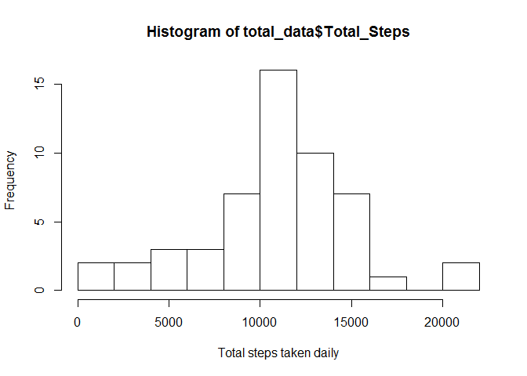
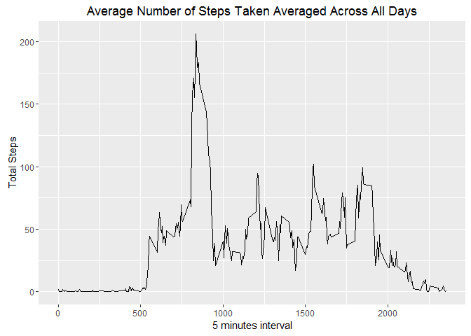
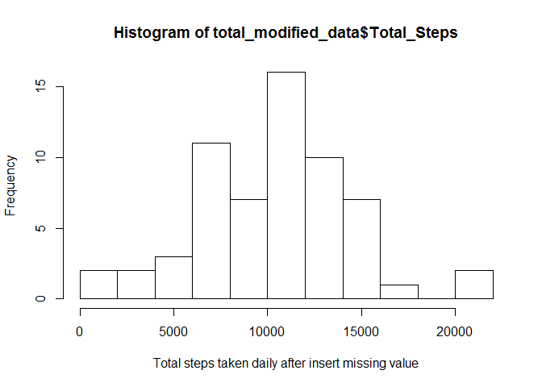
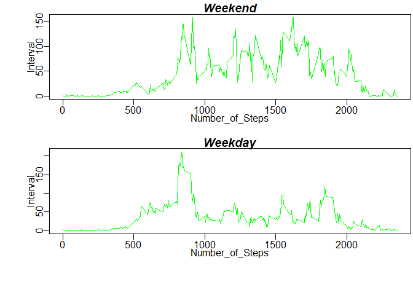

Loading and preprocessing the data
----------------------------------

``` r
setwd("F:/NVDIMM/datascience/Coursera/reproducible/week2")
unzip("activity.zip")
activities <- read.csv("activity.csv",header=TRUE, fill=TRUE)
```

What is mean total number of steps taken per day?
-------------------------------------------------

Calculate the total number of steps taken per day Make a histogram of the total number of steps taken each day

``` r
total_data <- aggregate(steps ~ date,data=activities,FUN=sum)
names(total_data) <- c("Date","Total_Steps")
hist(total_data$`Total_Steps`, breaks=10, xlab="Total steps taken daily")
```



Calculate and report the mean and median of the total number of steps taken per day

``` r
mean_data <- mean(total_data$Total_Steps, na.rm = TRUE)
median_data <- median(total_data$Total_Steps, na.rm = TRUE)
d <- data.frame(Mean=mean_data,median=median_data)
print(kable(d),type='html')
```

    ## 
    ## 
    ##      Mean   median
    ## ---------  -------
    ##  10766.19    10765

Average daily activity pattern
------------------------------

``` r
activity_pattern<- aggregate(steps ~ interval,data=activities, FUN=mean, na.rm = TRUE)
names(activity_pattern) <- c("Interval","Total_Steps")
ggplot(activity_pattern, aes(x = Interval, y = Total_Steps))+
                       theme_grey()+geom_line()+
                       labs(x="5 minutes interval", y="Total Steps")+
                       labs(title="Average Number of Steps Taken Averaged Across All Days")
```



``` r
Max_interval_seq <- which.max(activity_pattern$Total_Steps)
Max_interval <- activity_pattern$Interval[Max_interval_seq]
```

The interval which contains the maimum number of steps

``` r
m <- data.frame(Interval=Max_interval,Num_of_Steps=activity_pattern$Total_Steps[Max_interval_seq])
print(kable(m),type='html')
```

    ## 
    ## 
    ##  Interval   Num_of_Steps
    ## ---------  -------------
    ##       835       206.1698

Imputing missing values
-----------------------

Calculate and report the total number of missing values in the dataset

``` r
NA_ROW <- NROW(which(is.na(activities$steps)==TRUE))
NA_ROW
```

    ## [1] 2304

fill missing data into insert\_missing with mean for that 5-minutes interval data

``` r
insert_missing <- activities
mean_data_per_interval <- aggregate(steps ~ interval,data=activities,FUN=mean, na.rm = TRUE)
names(mean_data_per_interval) <- c("Interval","Mean_Interval_Steps")

for (i in 1:nrow(insert_missing)) {
  if(is.na(insert_missing[i,]$steps)){
    j <-insert_missing[i,]$interval/5+1
    insert_missing[i,]$steps <- mean_data_per_interval[j,]$Mean_Interval_Steps
  }
}
```

total number of steps taken each day and Calculate and report the mean and median total number of steps taken per day

``` r
total_modified_data <- aggregate(steps ~ date,data=insert_missing,FUN=sum)
names(total_modified_data) <- c("Date","Total_Steps")
mean_modified_data <- mean(total_modified_data$Total_Steps, na.rm=TRUE)
median_modified_data <- median(total_modified_data$Total_Steps, na.rm=TRUE)
hist(total_modified_data$`Total_Steps`, breaks=10, xlab="Total steps taken daily after insert missing value")
```



``` r
After_Insert <- data.frame(Mean=mean_modified_data,Median=median_modified_data)
print(kable(After_Insert),type='html')
```

    ## 
    ## 
    ##      Mean   Median
    ## ---------  -------
    ##  10282.14    10395

Activity patterns between weekdays and weekends
-----------------------------------------------

Create a new factor variable in the dataset with two levels - "weekday" and "weekend"

``` r
date_type <- function(newdata){
  if(weekdays(as.Date(newdata)) %in% c("Saturday","Sunday")){
    "Weekend"
  }else
  {
    "Weekday"
  }
}
total_daytype_data <- insert_missing
total_daytype_data$datetype <- as.factor(sapply(insert_missing$date, date_type))
head(total_daytype_data)
```

    ##       steps       date interval datetype
    ## 1 1.7169811 2012-10-01        0  Weekday
    ## 2 0.3396226 2012-10-01        5  Weekday
    ## 3 0.1320755 2012-10-01       10  Weekday
    ## 4 0.1509434 2012-10-01       15  Weekday
    ## 5 0.0754717 2012-10-01       20  Weekday
    ## 6 2.0943396 2012-10-01       25  Weekday

plot a series plot of the 5-minutes interval and average number of steps taken.

``` r
par(mfrow = c(2, 1),
    mar=c(3,2,1,0)+0.1,
#    fin=c(6,3),
    mgp=c(1.1,0.4,0),
    font.main=4,
    font.lab=1,
    oma=c(2,2,0,0)+0.1
    )

for(type in c("Weekend","Weekday")){
  datetype_pattern <-  aggregate(steps ~ interval,data=total_daytype_data, subset= datetype == type,FUN=mean, na.rm = TRUE)
names(datetype_pattern) <- c("Number_of_Steps","Interval")
plot(datetype_pattern, type = "l",lty="solid", main = type, col="Green")

}
```


